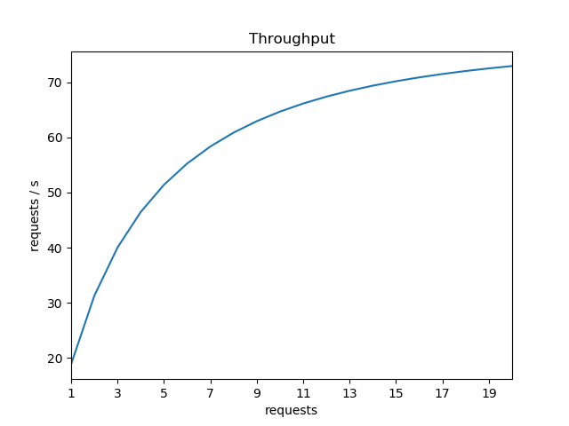
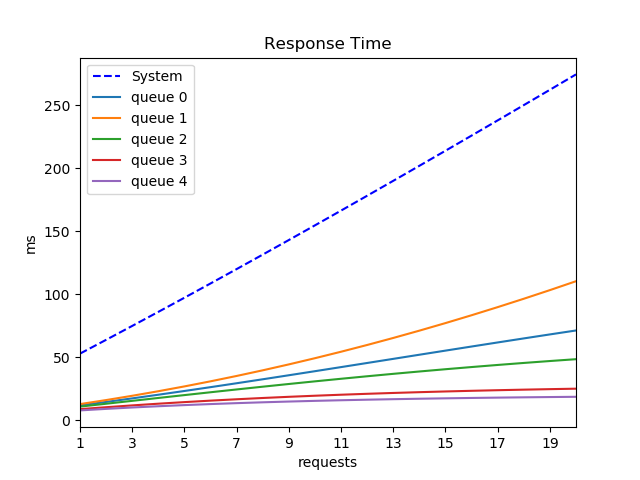
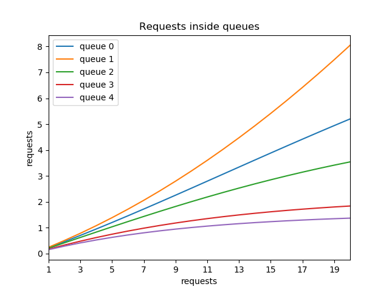

## What is this?

These are a couple of small scripts for students attending "Capacity Planning" course at Sapienza univeristy with prof. Bruno Ciciani. What they do is just calculate numerically the solution of two of the most recurring problem during the course, which are:
  - (__markov.py__) When you have a generic `M/M/x/y` queue (`x` servers, `y` finite length) represented by a Markov chain with `y+1` states (0, 1, ..., `y`) and you want to know the probabilities to be in each state, to calculate the _average throughput_, _average response time_,  _utilization factor_, _expected number of waiting requests_ and the _fraction of lost requests_
  - (__MVA.py__) Mean Value Analysis: calculate the _response time_, _throughput_ and _identify the bottleneck_ when you have multiple `M/M/1` queues in series
  
__NB__ These scripts don't do any magic, they just return the numerical value once the problem is set. The numerical solution is not required during the exam, since it may take a long time to do these calculations by hand, but I think that sometimes having the actual numbers could be interesting and makes you understand if you made some serious mistakes.


For any mistake/error that you find feel free to open a pull request and don't tell it to the prof. or he cancels my grade

## Examples

- __markov.py__

```
    $ python markov.py --draw

    Max number of requests waiting inside the system: 5
     -> Lambda from 0 to 1 : 1
     -> Lambda from 1 to 2 (empty to autocomplete from previous):
    Autocomplete
     -> Lambda from 1 to 2: 1.0
     -> Lambda from 2 to 3: 1.0
     -> Lambda from 3 to 4: 1.0
     -> Lambda from 4 to 5: 1.0
     <- Mu from 1 to 0 : 2
     <- Mu from 2 to 1 (empty to autocomplete from previous):
    Autocomplete
     <- Mu from 2 to 1: 2.0
     <- Mu from 3 to 2: 2.0
     <- Mu from 4 to 3: 2.0
     <- Mu from 5 to 4: 2.0
    
    P0 = 0.51
    P1 = 0.25
    P2 = 0.13
    P3 = 0.06
    P4 = 0.03
    P5 = 0.02
    
    >>> Utilization factor (1-P0): 0.492
    
    >>> Fraction of lost requests (P5): 0.016
    
    >>> X mean = 0.98 requests/s
    >>> X mean normalized = 2.00 requests/s
    
    >>> N mean = 0.83 requests
    
    >>> R mean = 0.84 s
    >>> R mean normalized = 1.70 s
```


---

- __MVA.py__

```
$ python MVA.py --plot

Number of queues in series: 5
Insert service time (D) of queue 0 (in ms): 12
Insert service time (D) of queue 1 (in ms): 13
Insert service time (D) of queue 2 (in ms): 11
Insert service time (D) of queue 3 (in ms): 9
Insert service time (D) of queue 4 (in ms): 8
Input N (calculate MVA from 1 to N incoming requests ): 20

>>> N = 1
        R(1) = 0.053 s
        X(1) = 18.87 requests/s
        n in queues: ['0.23', '0.25', '0.21', '0.17', '0.15']
        - - - - - - - - - - - - - - -

>>> N = 2
        R(2) = 0.064 s
        X(2) = 31.29 requests/s
        n in queues: ['0.46', '0.51', '0.42', '0.33', '0.29']
        - - - - - - - - - - - - - - -

>>> N = 3
        R(3) = 0.075 s
        X(3) = 40.03 requests/s
        n in queues: ['0.70', '0.78', '0.62', '0.48', '0.41']
        - - - - - - - - - - - - - - - 
[ ... ]

>>> N = 19
        R(19) = 0.262 s
        X(19) = 72.49 requests/s
        n in queues: ['4.95', '7.49', '3.42', '1.80', '1.35']
        - - - - - - - - - - - - - - -

>>> N = 20
        R(20) = 0.274 s
        X(20) = 72.92 requests/s
        n in queues: ['5.20', '8.05', '3.54', '1.84', '1.37']
        - - - - - - - - - - - - - - -
```






